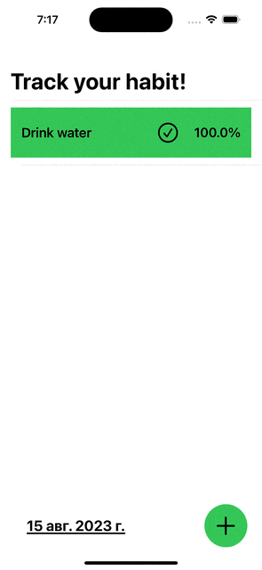

# Day 47: 🚵 HabitTracker (Milestone)

### Purpose of the App :

An app to track a habit and mark every time you practice or do the activity.

##

### Features Learned :

- Paths 
- Shapes 
- MVVM 
- UserDefaults 
- JSONDecoder/Encode
- Navigation Views/Links
- Sheets
- animatableData

##

**Screenshoots :**

